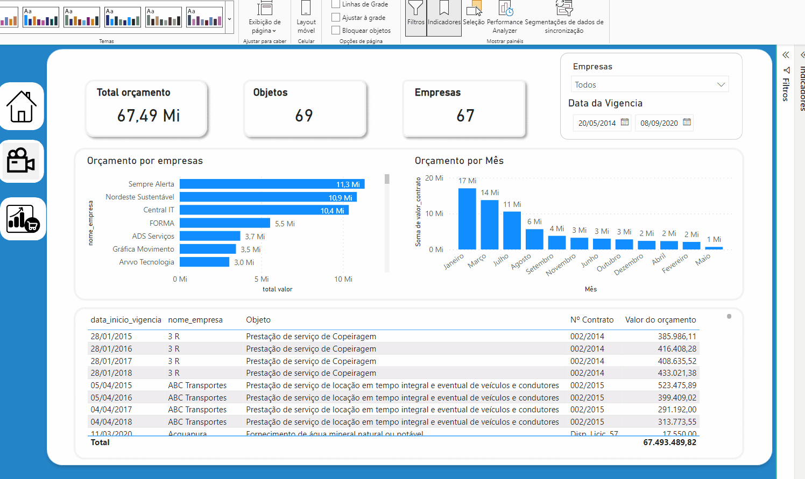

<h1 align="center">
 
  
 
 
 Dashbord em Power BI com BigQuery

</h1>

O projeto pega dados de duas origem um de API do site themoviedb.org e outra do governo sobre o contratos feitos pelo misteria da fazenda  
<ul>
<li>The movie : dados dos ultimos filme visto sua origem e sua popularidade apos sua estreia mundial</li>
<li>Do Governo tem de acesso publico</li>
<li>"id_contrato": "Identificador ?nico sequencial do contrato",
    "nome_contrato": "Nome do contrato",
    "objeto_contrato": "Assunto ao qual se refere o contrato",
    "valor_contrato": "Valor do contrato, em Reais",
    "inicio_vigencia": "In?cio de vig?ncia do contrato",
    "termino_vigencia": "T?rmino de vig?ncia do contrato",
    "fk_empresa_contratada": "Chave estrangeira da empresa contratada",
    "id_data": "Identificador ?nico da data",
    "data": "Data no formato DD/MM/AAAA",
    "id_empresa": "Identificador ?nico da empresa contratada",
    "nome_empresa": "Nome da empresa contratada"</li>
    <li>
    Houve um tratamento dos dados (ELT) via Python envio para carregamento no BigQuery do google
    </li>
</ul>

  

  

      

    
  

    

  

## Tecnologia usada

Power BI - Micro soft
BigQuery - Google

-  **DAX** Dax 
 - **Python** tratamento do dados 
-  **POWER BI ** ” Cria??o de Dash bord em Power BI
-  **JQuery** para cadastro de imagens
- **R**  para csv

## Modelos

1. Modelo realizado dados  reais
2. Todos os direito autoras pela david orion 
3. Modelo apenas ilustratorio 

### Equipe de desenvolvimento

1. David orion (Analista de sistemas)

